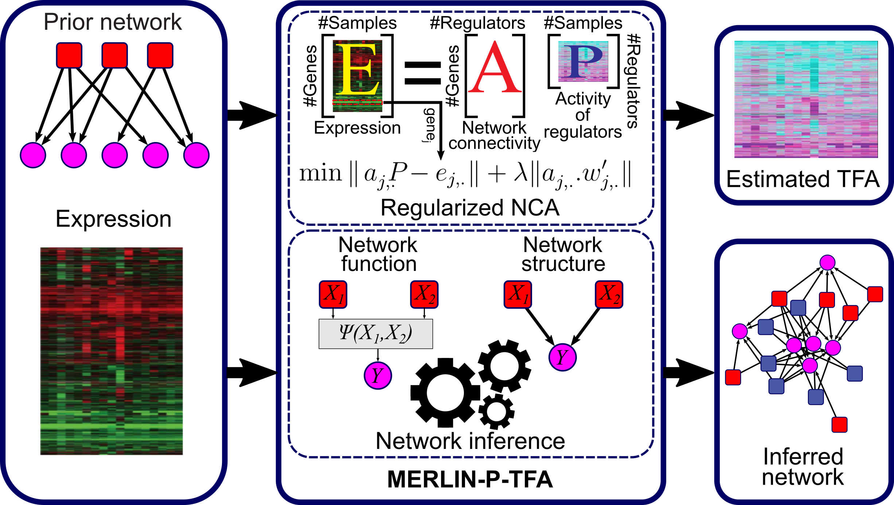
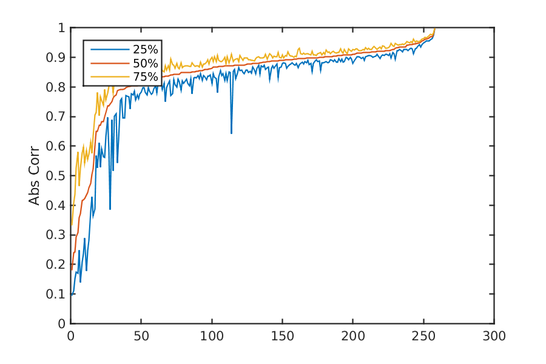

### Regularized NCA for estimating TF activity

[](http://perso.crans.org/besson/LICENSE.html)
[](https://github.com/Roy-lab/EstimateNCA/releases/tag/v1.0.0)

Regularized NCA uses the same framework as original NCA (Liao et al. PNAS 2003), but uses a modified LASSO formulation to incorporate edge confidence from input network.
Briefly, NCA uses a two step iterative method, estimates TFA profiles from current network, and then estimate regression coefficients of network from the new TFA, and repeats until convergance.
In regularized TFA, when estimating regression coefficients, we use a modified LASSO to incorporate edge confidence in order to shrink low confidence interactions from the model.

We add the resulting TFA profiles to our inference method [MERLIN-P](https://github.com/Roy-lab/merlin-p) (Roy et al. PLOS Comput Biol 2013, Siahpirani & Roy NAR 2017) which we call MERLIN-P+TFA.



### Run

You will need GSL library to compile the code. In order to compile to code, navigate to code directory and make.

You can run the program as:

```
./NCALearner -d example/in/exp.txt -r example/in/tfs.txt -g example/in/targets.txt -p example/in/prior.txt -o example/out/
```

The input options are: 
```
-h  prints the usage.
-d	is the expression matrix.
-r  is the list of TFs (we only consider these).
-g  is the list of targets (we only consider these).
-p  is the prior network.
-l  is the lambda for NCA.
-o  is output directory.
```

We have some example input/output files in:

```
example/in:
	exp.txt
	prior.txt
	targets.txt
	tfs.txt

example/out:
	adj.txt
	tfa.txt
```

You can find examples on how to take average of multiple rand inits and compare them to each other under example/stability_example/ 


